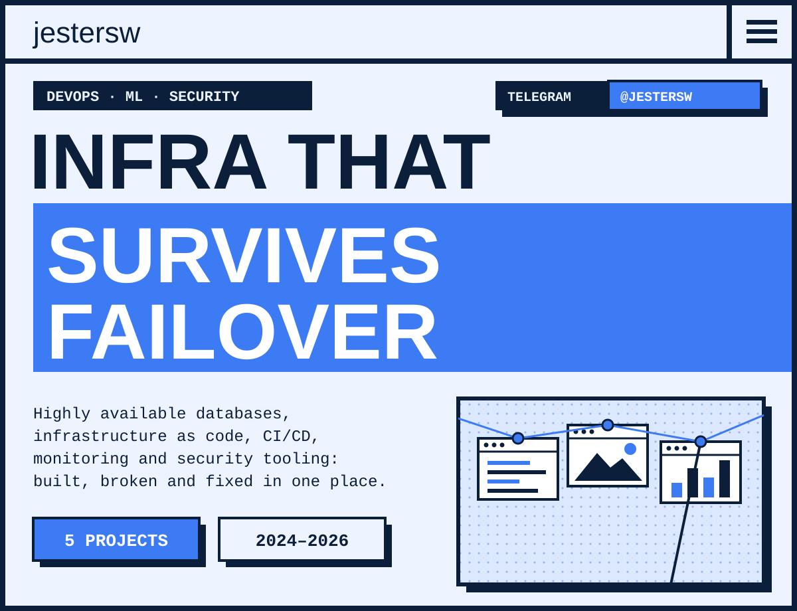
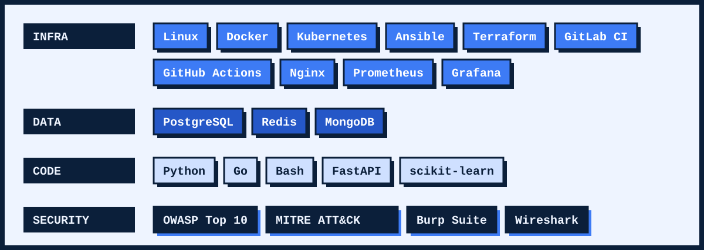
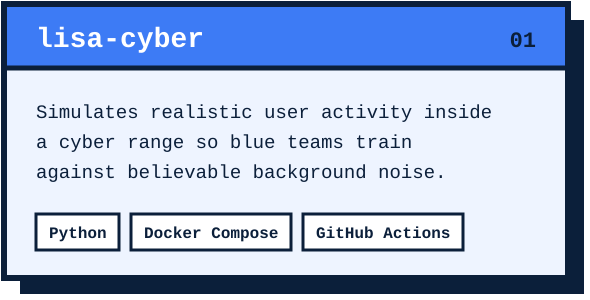
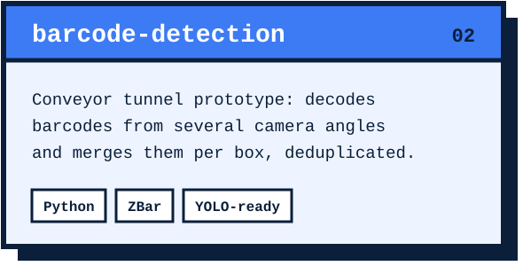
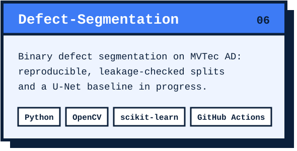
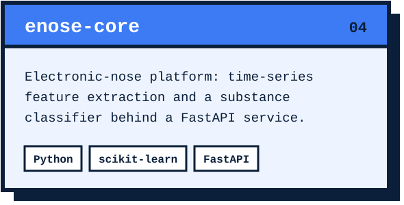
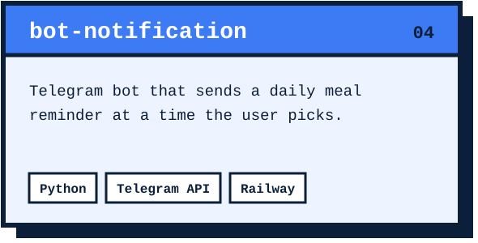
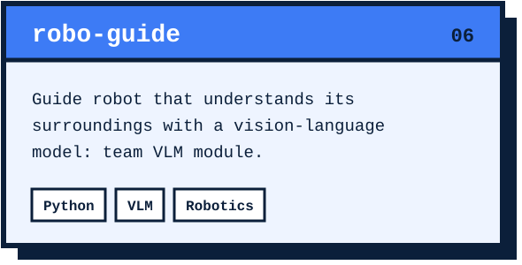

  

DevOps engineer with an ML and Python backend background.
I build infrastructure that keeps working when a node dies: highly available databases, Ansible automation, CI/CD pipelines.
Blue Team security experience from CTFs and cyber battles.

- Deploying fault-tolerant **Redis + Sentinel**, **PostgreSQL (Patroni · etcd · HAProxy · keepalived)** and **MongoDB replica sets**, then breaking them on purpose to prove failover works
- Turning those deployments into idempotent **Ansible** playbooks driven by **GitLab CI**
- Learning: production Kubernetes and centralized logging

  

  
  

  
  

  
  

